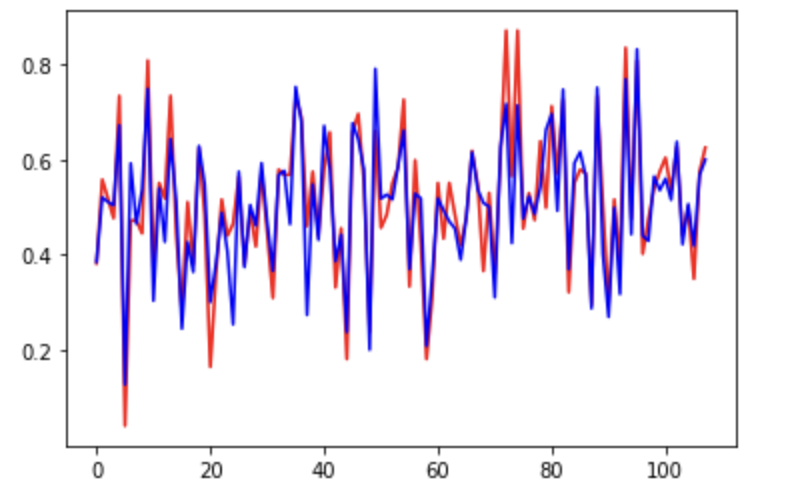
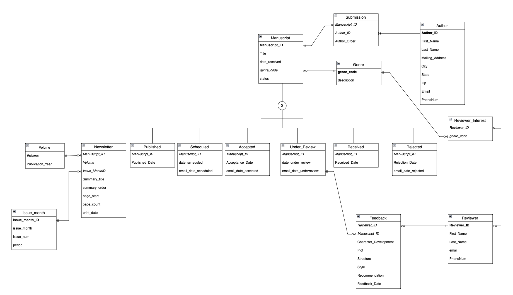
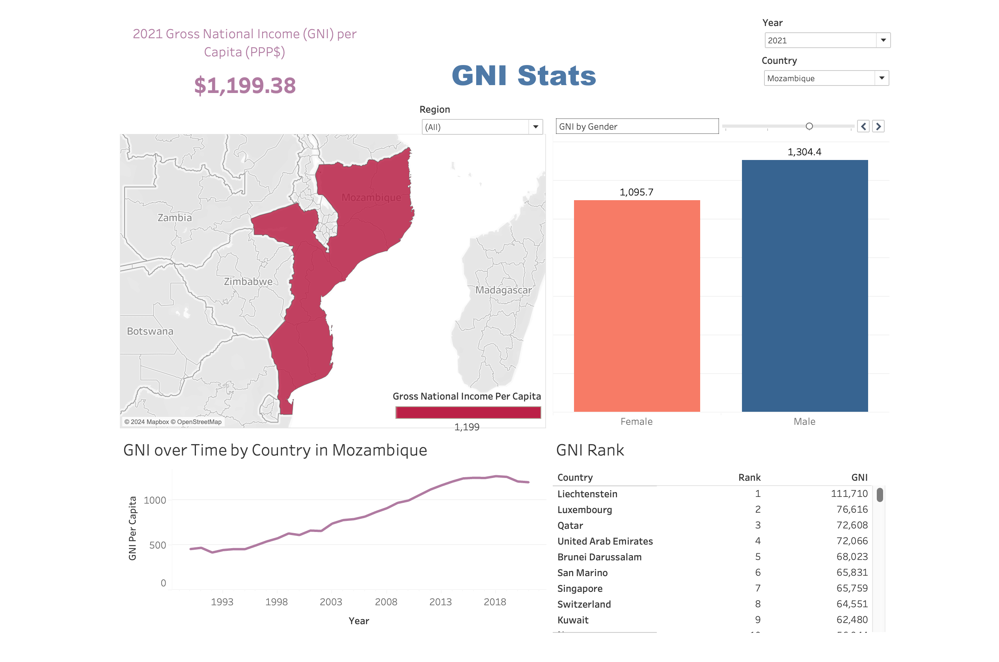
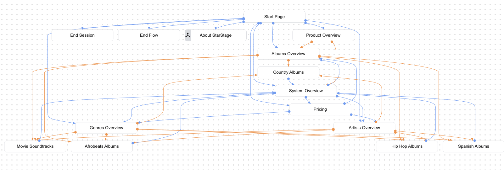
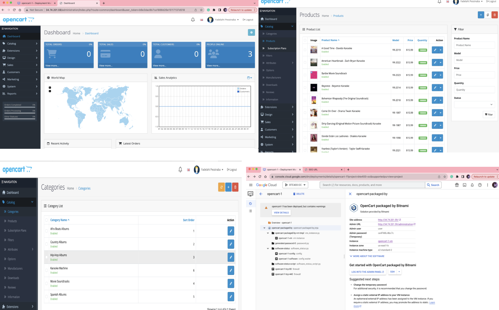
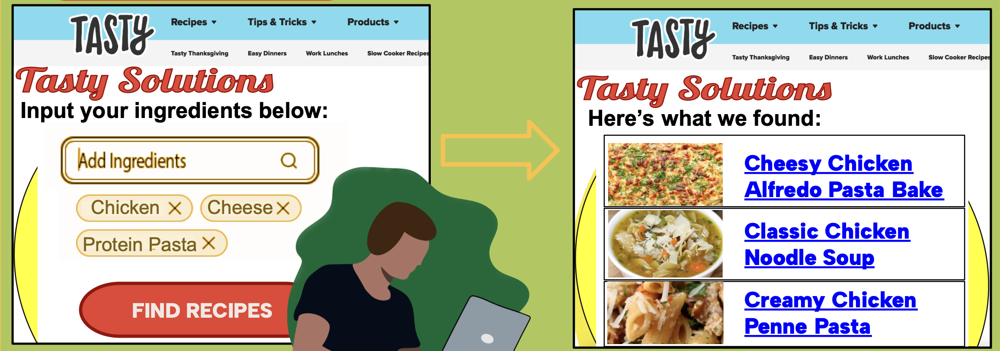
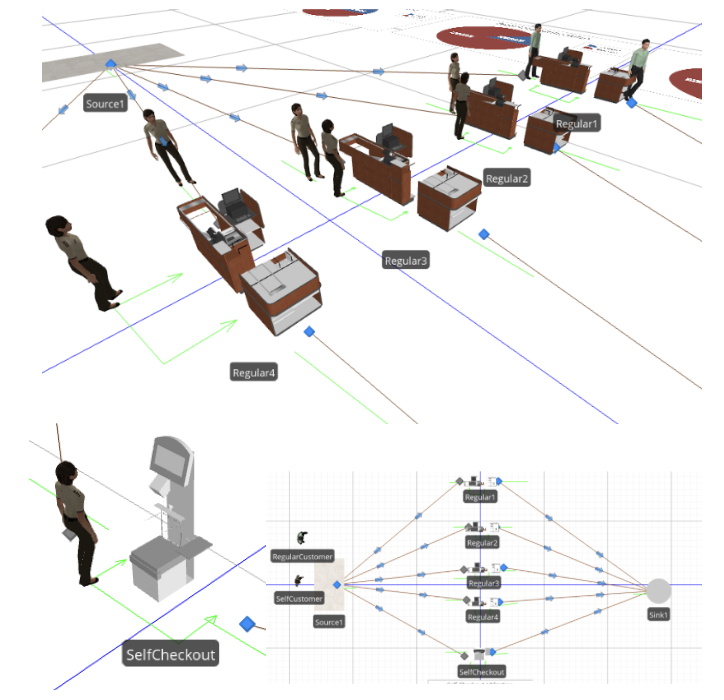
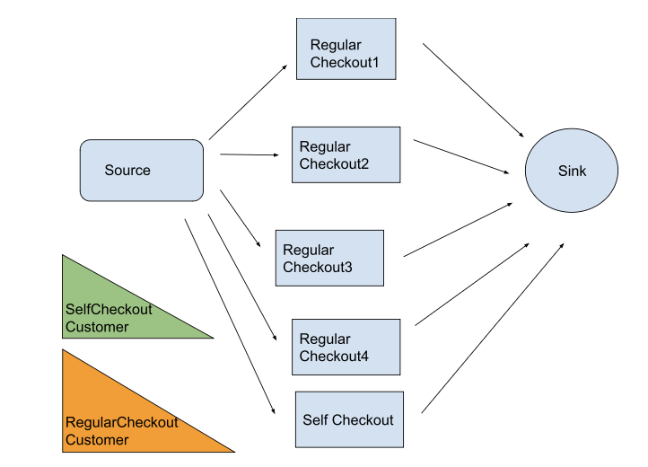
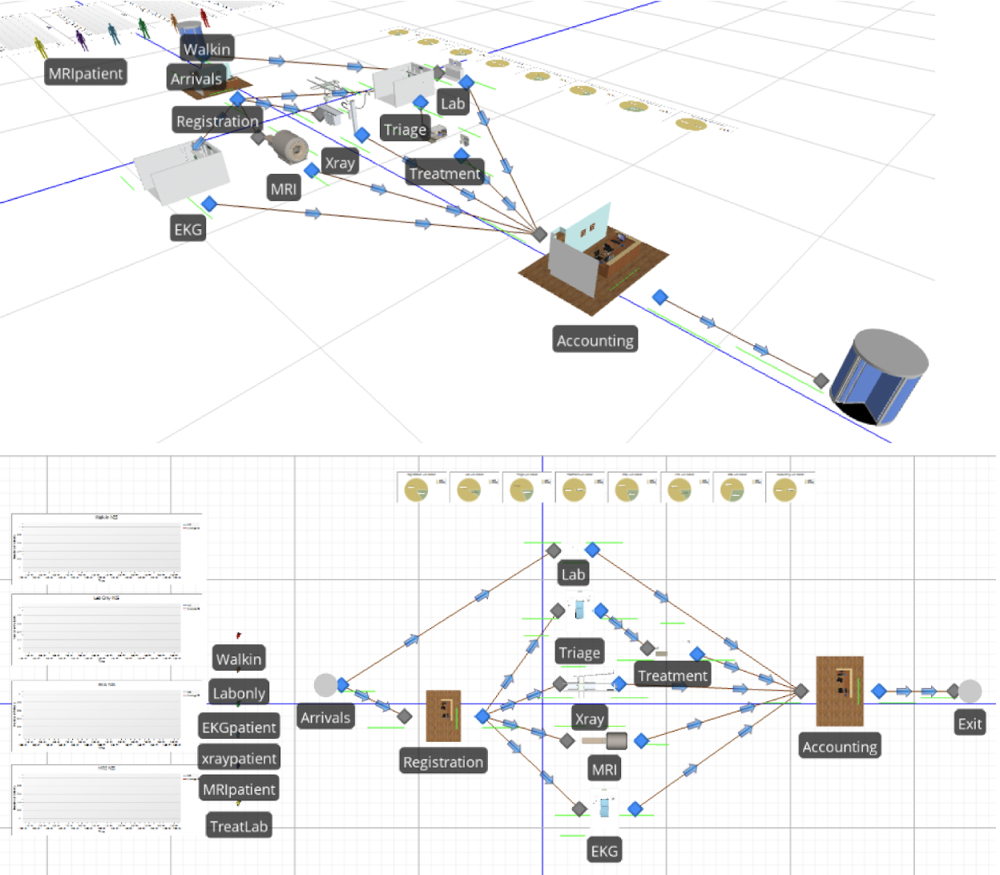
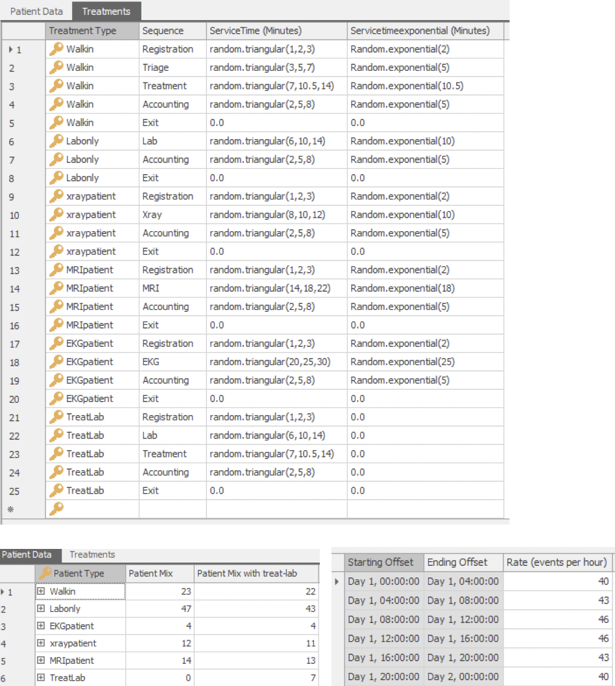

# Portfolio
---
## Data Analysis and Database Design

### BTE420: Python Programming for Fintech

Final Project for [***BTE420: Python Programming for Fintech***] by University of Miami (Spring, 2022).

**Istanbul Stock Exchange Regression:** Trained a Regression Model to predict ISE stock prices using historical data of other international indices as inputs. Split the data into train and test sets, then used the training set and the SciKitLearn's Decision Tree Regressor to train a model. Created a simple visualization that demonstrated the regression's accuracy by comparing predicted versus actual ISE prices of the test dataset.  ([GitHub](https://github.com/mikhalastepek/Istanbul-Stock-Exchange-Regression/blob/9eb411ce98719909cb44e708834aff1d285c1f58/final_project_bte420.ipynb)).

---
### BTE 423: Database Management Systems

Final Project for [***BTE 423: Database Management Systems***] by University of Miami (Fall, 2022).

**Publishing Company Database Design and Query:** Used SQL to create and populate a database for a printing and publishing company, then completed queries to solve business problems. Created an ERD (entity relationship diagram) to represent the entities (Authors, Publishers, Books etc) and how they relate to eachother. Then used the ERD as a framework for database design in SQL. Finally, performed queries to analyze success of various authors, genres, and more. ([GitHub](https://github.com/mikhalastepek/U-R-Published-Database-Design/blob/92fcfffdcc4a2bd41059b0b982fbbf37005e9836/database-and-queries.sql)).

---
### MAS 332: Data Acquisition, Preparation and Visualization

Final Project for [***MAS 332: Data Acquisition, Preparation and Visualization***] by University of Miami (Fall 2022).

**Human Development Index Dashboard on Gross National Income Statistics:** Uploaded Human Development Index data to Tableau to analyze factors that contribute to HDI; cleaned and pre-processed data in Excel, then analyzed and created visualizations in Tableau. Our visualization focused on demonstrating variances in GNI by country, geographic region, gender, and year.

---

## Cloud and Web Design

### BTE 400: Web-Mobile-Cloud

Final Project for [***BTE 400: Web-Mobile-Cloud***] by University of Miami (Fall, 2023).

**E-Commerce Innovation:** Created an e-commerce business using OpenCart to design an online storefront with multiple pages that provided information about the company and a catalog of its products, as well as a functional checkout page. My primary contribution to the project was to create and train a chatbot that answered questions about the company, the products, and pricing information. I created it using Dialogflow on Google Cloud Platform and then installed it on the website using HTML.

---
## AI Programming

### BTE 471: AI Programming for Business Management

Final Project for [***BTE 471: AI Programming for Business Management***] by University of Miami (Fall, 2023).

**AI Innovation for Tasty Co:** Created a recipe recommendation system for Tasty Co that suggested Tasty Recipes based on input ingredients from users. Developed a Prolog program that returned relevant recipes given ingredients that customers wanted to put to use. Developed a flowchart of the program's process and visualizations for potential UX/UI design. Presented the idea, noting the interest that Tasty's target market has in AI and sustainability as well as the product's ability to serve as a sustainably-minded response to the global food waste problem. ([GitHub](https://github.com/mikhalastepek/Tasty-AI)).

---

## Simulation Modeling

### MAS 547: Computer Simulation Systems

Final Project and other assignments for [***MMAS 547: Computer Simulation Systems***] by University of Miami (Fall 2022).

**Grocery Store Checkout queuing analysis:** Simulated a grocery store checkout system in SIMIO with 4 regular checkout lanes and 1 self checkout lane, with the goal of determining the optimal number of self checkout registers within the self checkout lane to move customers through the checkout process the fastest. Researched and collected data to assign accurate processing times to different servers and accurate arrival rates to different times of day. Created a model animation and ran simulations testing various numbers of self checkout registers to determine which is most efficient.

---

**Hospital simulation queuing theory analysis:** Used SIMIO to simulate patients (walk in and scheduled) moving through a hospital with various types of rooms and appointments (Lab, Triage, XRay, MRI, EKG, treatment). Created a database of types of patients and treatments and assigned probability distributions to different combinations of patient and treatment types to define service time. Created pie charts and line graphs to track server utilization, and compared outcomes with deterministic values calculated in excel. Ran multiple simulations for varying interarrival times. Analyzed utilization rates and time in system after running simulations, and provided suggestions to increase efficiency of the system.

---
